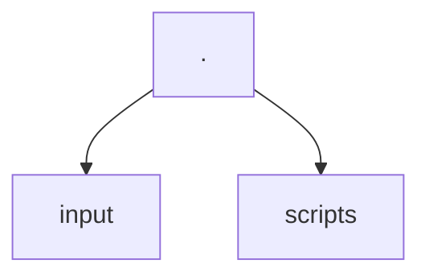
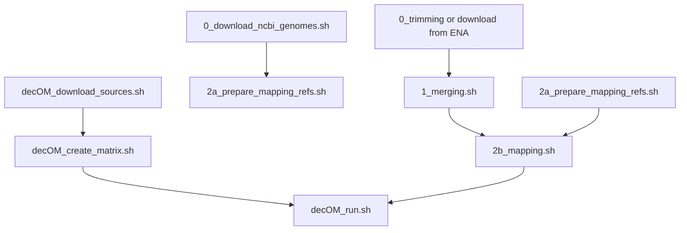

### Directory structure

```mermaid
graph TB;
    A[.]-->B[input];
    A-->C[scripts];
```

**Scripts: **

```mermaid
graph TB;
    A[0_trimming or download from ENA]-->B[1_merging.sh]
    B-->C[2b_mapping.sh];
    D[0_download_ncbi_genomes.sh]-->E[2a_prepare_mapping_refs.sh];
    F[2a_prepare_mapping_refs.sh]-->C;
    G[decOM_download_sources.sh]-->H[decOM_create_matrix.sh];
    H-->I[decOM_run.sh];
    C-->I;
```
