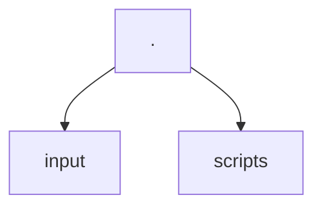
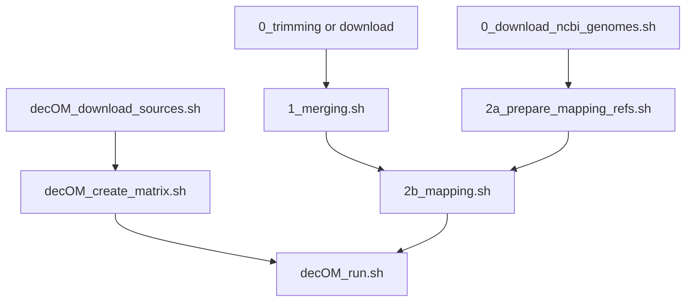

### Directory structure

```mermaid
graph TB;
    A[.]-->B[input];
    A-->C[scripts];
```

**Scripts:**

```mermaid
graph TB;
    A[0_trimming or download]-->B[1_merging.sh]
    B-->C[2b_mapping.sh];
    D[0_download_ncbi_genomes.sh]-->E[2a_prepare_mapping_refs.sh];
    E-->C;
    F[decOM_download_sources.sh]-->G[decOM_create_matrix.sh];
    G-->H[decOM_run.sh];
    C-->H;
```
