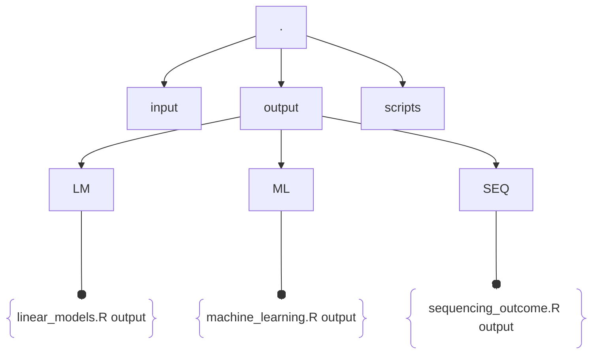

### Directory structure

```mermaid
graph TB;
    A[.]-->B[input];
    A-->C[output];
    A-->D[scripts];
    C-->E[LM];
    C-->F[ML];
    C-->G[SEQ];
    E---oH@{ shape: braces, label: "linear_models.R output"};
    F---oI@{ shape: braces, label: "machine_learning.R output"};
    G---oJ@{ shape: braces, label: "sequencing_outcome.R output"};
```
